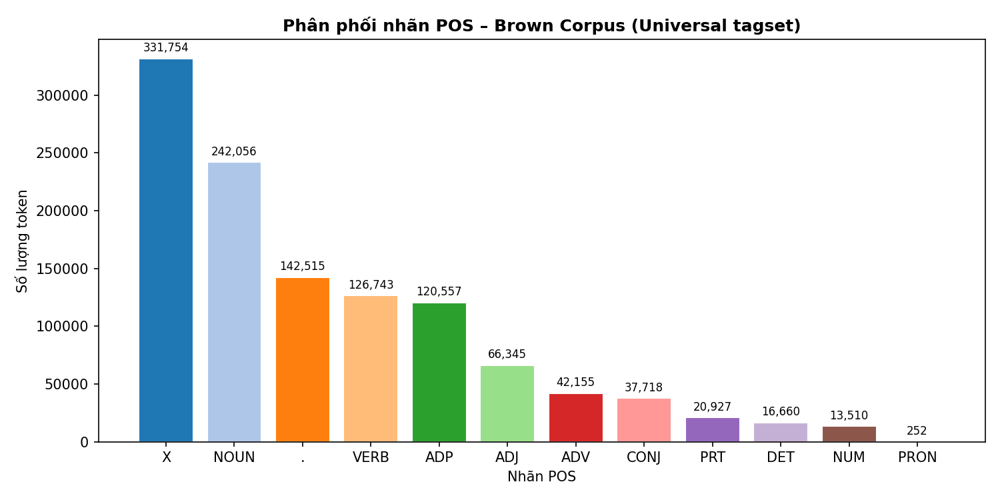
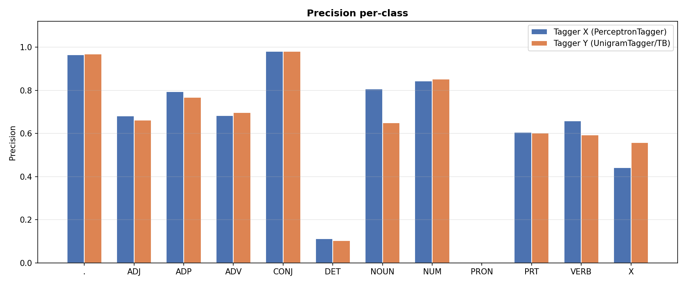
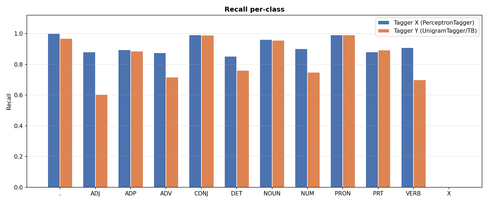
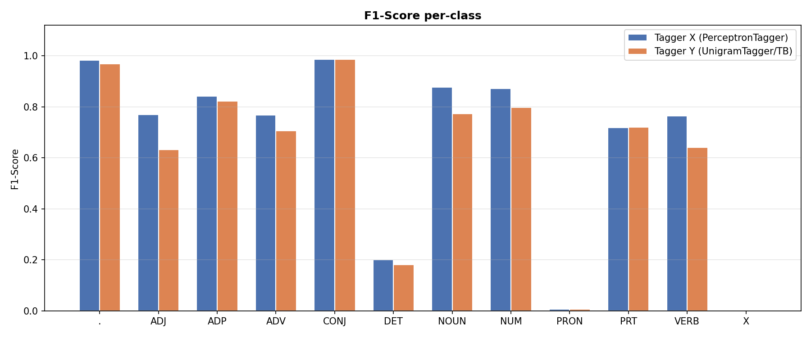
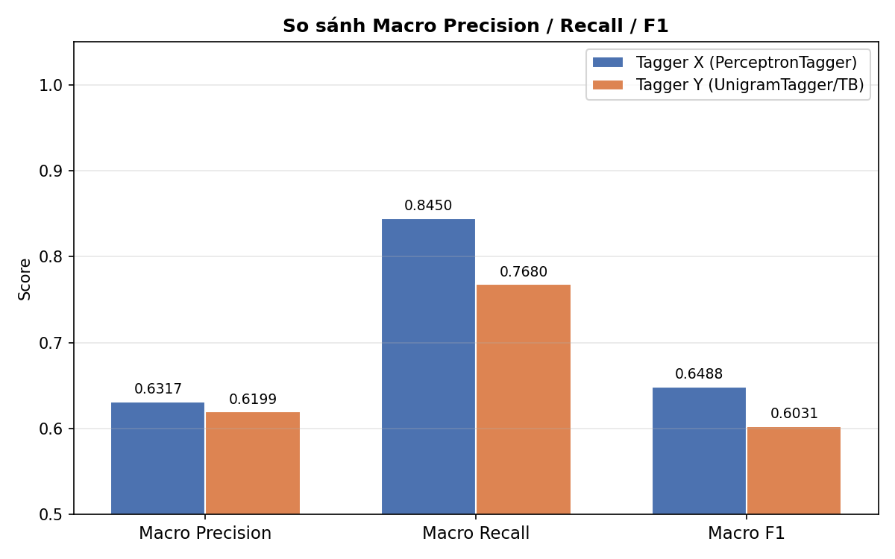

# POS Tagging – Brown Corpus

## Mô tả bài toán

Gán nhãn từ loại (POS Tagging) cho toàn bộ **Brown Corpus** (NLTK, Universal Tagset).
Toàn bộ corpus được dùng làm **golden reference** để đánh giá — **không có bước huấn luyện trên Brown**.

## Dữ liệu

| Thuộc tính   | Giá trị       |
|--------------|---------------|
| Tổng câu     | 57,340        |
| Tổng token   | 1,161,192      |
| Số nhãn POS  | 12            |
| Tagset       | Universal     |

## Hai bộ POS Tagger

### Tagger X – NLTK PerceptronTagger (`nltk.pos_tag`)
- Averaged Perceptron Tagger, **pre-trained sẵn** trên Penn Treebank (WSJ).
- Gọi trực tiếp qua `nltk.pos_tag()`, không cần training.
- Output PTB tags, map về Universal tagset để so sánh.

### Tagger Y – UnigramTagger train trên Penn Treebank
- `UnigramTagger` train trên `nltk.corpus.treebank` (Penn Treebank, **khác Brown**).
- Backoff: `DefaultTagger('NOUN')` cho từ chưa gặp.
- **Không train trên Brown corpus** — tránh data leakage.

## Kết quả đánh giá

### Macro Precision / Recall / F1

| Tagger                     | Precision | Recall | Macro-F1 |
|----------------------------|-----------|--------|----------|
| PerceptronTagger (X)       |    0.6317 | 0.8450 |   0.6488 |
| UnigramTagger/TB (Y)       |    0.6199 | 0.7680 |   0.6031 |

### Per-class: Tagger X (PerceptronTagger)

| Tag    | Precision | Recall | F1-Score |
|--------|-----------|--------|----------|
| .      |    0.9657 | 1.0000 |   0.9825 |
| ADJ    |    0.6821 | 0.8805 |   0.7687 |
| ADP    |    0.7938 | 0.8940 |   0.8409 |
| ADV    |    0.6828 | 0.8748 |   0.7670 |
| CONJ   |    0.9814 | 0.9920 |   0.9867 |
| DET    |    0.1134 | 0.8518 |   0.2001 |
| NOUN   |    0.8069 | 0.9619 |   0.8776 |
| NUM    |    0.8426 | 0.9024 |   0.8715 |
| PRON   |    0.0038 | 0.9921 |   0.0075 |
| PRT    |    0.6061 | 0.8808 |   0.7181 |
| VERB   |    0.6594 | 0.9087 |   0.7642 |
| X      |    0.4420 | 0.0007 |   0.0013 |

### Per-class: Tagger Y (UnigramTagger/Treebank)

| Tag    | Precision | Recall | F1-Score |
|--------|-----------|--------|----------|
| .      |    0.9685 | 0.9682 |   0.9683 |
| ADJ    |    0.6628 | 0.6039 |   0.6320 |
| ADP    |    0.7669 | 0.8861 |   0.8222 |
| ADV    |    0.6968 | 0.7169 |   0.7067 |
| CONJ   |    0.9816 | 0.9899 |   0.9857 |
| DET    |    0.1034 | 0.7612 |   0.1820 |
| NOUN   |    0.6489 | 0.9558 |   0.7730 |
| NUM    |    0.8528 | 0.7488 |   0.7974 |
| PRON   |    0.0038 | 0.9921 |   0.0076 |
| PRT    |    0.6025 | 0.8937 |   0.7198 |
| VERB   |    0.5929 | 0.6985 |   0.6414 |
| X      |    0.5584 | 0.0003 |   0.0007 |

## Biểu đồ







## Nhận xét

- **PerceptronTagger (X)**: Macro-F1 = **0.6488** — pre-trained trên WSJ, mạnh ở các tag phổ biến.
- **UnigramTagger/TB (Y)**: Macro-F1 = **0.6031** — train trên Penn Treebank nhỏ hơn, backoff về NOUN.
- **Bộ tagger tốt hơn: PerceptronTagger (X)**.
- Cả hai đều không train trên Brown corpus, đây là đánh giá cross-corpus (domain transfer).
- Tag `X` (foreign words, symbols) và `PRT` (particle) thường có F1 thấp nhất ở cả hai tagger
  do ít mẫu và phân phối không đồng đều.

## Cách chạy

```bash
conda activate python3.11
pip install nltk scikit-learn matplotlib numpy
python pos_tagger.py
```